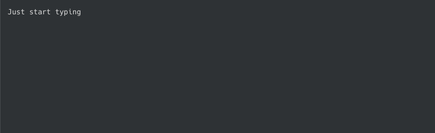

# Demo GIF

The demo gif is created using [Peek](https://github.com/phw/peek) and [AutoKey](https://github.com/autokey/autokey).

## Steps

1. Open Inkdrop and create a new note.
2. Start Peek and position it above the new note. You may have to repeat these steps a few times to get the size right.
3. Ensure Peek is configured to record 30 fps GIFs.
4. Start AutoKey, ensure the [script](./autokey.py) is added and a shortcut is bound to it.
5. Give focus to Inkdrop and then to Peek.
6. Move the cursor on top of the "Record as GIF" button and trigger the shortcut bound to the AutoKey script.
7. As soon as Peek starts counting down, move the cursor inside the Peek recording window so that it's on top of Inkdrop.
8. As soon as the typing starts, move the cursor on top of Peek's "Stop" button.
9. Wait until the AutoKey script is done, it will automatically press the "Stop" button when done.
